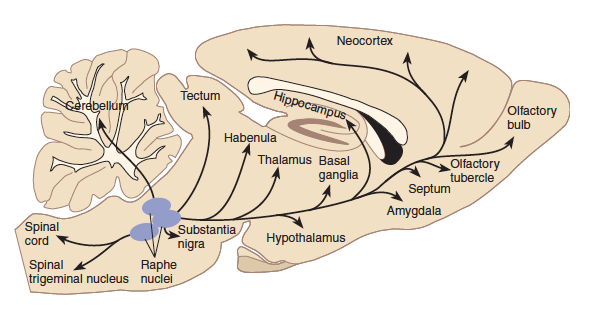
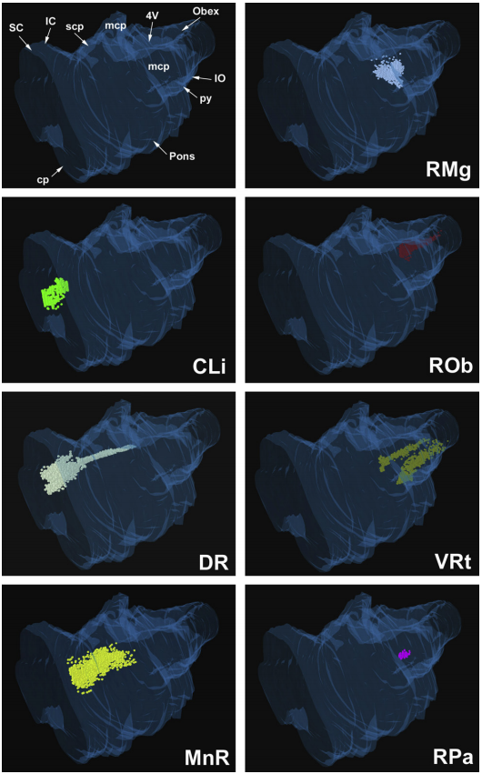
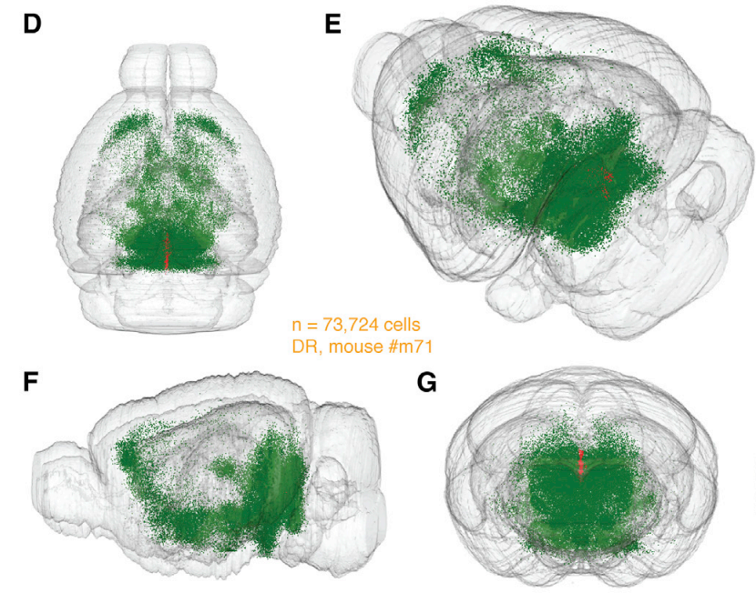
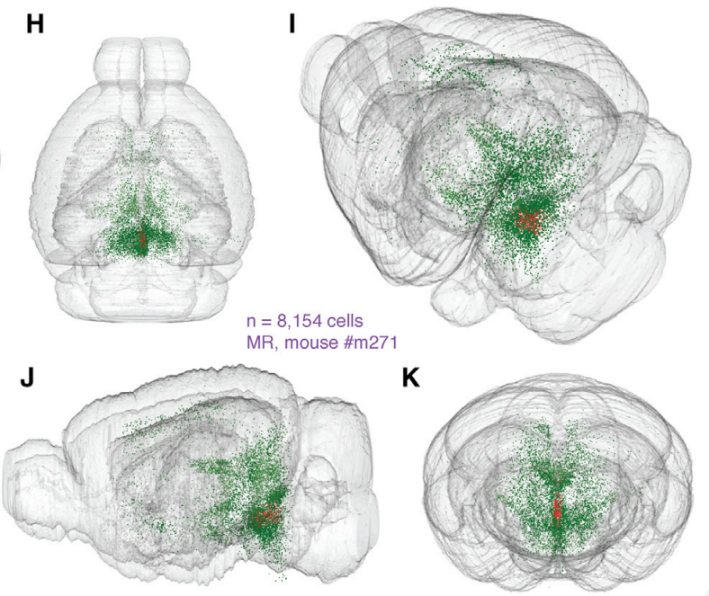

[1]:http://www.sciencedirect.com/science/article/pii/S0891061803001157?via%3Dihub
[2]:http://www.cell.com/neuron/pdf/S0896-6273(14)00583-2.pdf
[3]:http://neuronbank.org/wiki/index.php/Raphe_Nuclei
[4]:https://www.ncbi.nlm.nih.gov/pubmed/20426885
[5]:http://www.alliedacademies.org/articles/cell-numbers-in-the-dorsal-and-median-raphe-nuclei-of-as-andasagu-rats.pdf
[6]:http://sci-hub.bz/10.1016/B978-0-12-374236-0.10011-2

# Serotonin (5-HT)

Experiments with the local injection of 5-HT inhibitors in the raphé nuclei **support an inhibitory role** of the raphé nuclei in motivational behavior.

**The role of 5-HT in reward is complicated** by the fact that it binds to a large number of receptor types that have different effects on reward-oriented behavior  \[[1]\]. 

### Location

**MRN** (MnR) -- Median Raphe Nucleus
**DRN** (DR)-- Dorsal Raphe Nucleus
**RMg** -- Raphe Magnus Nucleus
**RPa** -- Raphe Pallidus Nucleus

> **Fig**. Three-dimensional representation of the reconstruction of brainstem from a series of transverse sections using the Solid View module of Neuroexplorer (Microbrightfield). The surface of the brainstem is represented in transparency, viewed from its anterior latero-dorsal aspect. Top left panel points to the main structures of reference for orientation. The localization of TPH-IR neurons in every eighth section of the series has been plotted in reference to the outline of the brainstem. The distribution of the TPH-IR neurons in each raphe nucleus is illustrated separately in individual panels. Notice that the rostral group of the raphe neurons (left panels) is spatially segregated from the caudal group mostly restricted to the medulla (right panels). The rostro-caudal length of the recontructed brainstem is 62 mm 
 \[[6]\].

## Neurons

DRN serotonergic neurons were identified by established criteria, which include wide-duration action potentials between 1–2 ms, positive-negative spikes, a regular rhythm and a slow firing rate (0.5–3 Hz). Burst-firing DRN serotonergic neurons were identified as described previously, by criteria including fired spike doublets or triplets with an intraburst time-interval fewer than 20 ms  \[[4]\].

### Neuron number

In DRN **8711 neurons** \[[5]\]. 
In MRN **1064 neurons** \[[5]\]. 

As mentioned earlier **the total number** of the serotonergic neurons is really small. In Rats the number of neurons is around **20,000** \[[3]\]. 

The **number of serotonergic neurons** in DR is larger than in MR,
although it is not established how that is represented in the absolute
number or differential distribution of inputs \[[2]\]. 

## Pathway

### Pathway as tracing All Inputs to 5HT Neurons

>
**Figure**. Three-Dimensional Mapping of All EGFP-Labeled Input Neurons in a Standardized Reference Atlas
(D–G) 3D visualization of whole-brain monosynaptic inputs to DR serotonergic neurons in one mouse showing 73,724 EGFP-labeled cells (green dots) from top
(D), angle (E), side (F), and back (G) view. Red dots: starter population in DR (EGFP+/TVA-mCherry+).
(H–K) 3D visualization of whole-brain monosynaptic inputs to MR serotonergic neurons in one mouse showing 8,154 

## Outputs

#### 1. Projections to the SNc and VTA
Electron microscopy studies have shown that 5-HT neurons make direct synaptic contacts with dopaminergic and non-dopaminergic neurons in the VTA, indicating the direct and indirect influence of the raphé nuclei on the midbrain dopamine system. Electrical stimulation of the MRN **inhibits** the majority of (but not all) **the activity of dopamine neurons**  \[[1]\].

As 5-HT2C receptors are mainly localized in GABAergic neurons in the SNr and VTA, which in turn inhibit dopamine neurons, the inhibitory effect of a 5-HT2C agonist on dopamine function is, at least in part, due to the GABA-mediated tonic inhibitory effect of 5-HT on mesolimbic and nigrostriatal dopamine function. 
> On the other hand, the activation of VTA 5-HT1B receptors increases mesolimbic dopamine release, probably by inhibiting GABA release  \[[1]\].

#### 2. Projection to SNr

The functional significance of 5-HT in the SNr, however, **is not well understood**.

> The SNr is one of the major targets of the DRN in rats, cats, and monkeys. In monkeys, 5-HT innervations are particularly dense in the SNr, but much less so in the SNc (Lavoie and Parent, 1990). Coexpression of 5-HT2C receptor mRNA with glutamic acid decarboxylase, but not with tyrosine hydroxylase mRNA, indicates that 5-HT2C receptors are restricted to GABAergic neurons. The functional significance of 5-HT in the SNr, however, is not well understood  \[[1]\].

#### 3. Projections to the amygdala

Several nuclei of the amygdala receive rich serotonergic innervations. In rats, the rostral and medial subregions are dense projection sites of 5-HT neurons. The effect of DRN on neurons in the amygdala **is reportedly inhibitory** and mediated by direct DRN-amygdala serotonergic projections  \[[1]\].

#### 4. Projections to the hypothalamus

The hypothalamus plays a significant role in the processing of natural rewards, such as food and sex, and it receives strong inputs from the DRN. Extracellular 5-HT levels increased in the medial and lateral hypothalamus during the anticipation and intake of food, but not after its consumption. Interestingly, this finding **was interpreted in line with the reward-inhibiting and satiety-facilitating functions of 5-HT in the hypothalamus**  \[[1]\].

#### 5. Projections to the cortex

The DRN also projects to virtually all cortical areas, and **its effect can be excitatory and inhibitory, depending on which layers it projects to and the presence of different receptor types**. Electrical stimulation of the DRN and MRN inhibits the majority of medial prefrontal cortex neurons via 5-HT1A or 5-HT2 receptors. Among several receptor types, 5-HT2A receptors are particularly dense in the prefrontal and anterior cingulate cortices, and they are primarily located on the apical dendrites of pyramidal neurons. Prefrontal 5-HT2A receptors may activate cortico-tegmental projection neurons, which in turn facilitate VTA dopamine neurons. On the other hand, *5-HT2A/2C receptors* are also present in the GABAergic interneurons of the cortex and **may regulate glutamatergic output**. 5-HT2C activation in the medial frontal cortex suppresses cocaine-seeking behavior \[[1]\].

#### Difference between DR and MR
Overall, the pattern of inputs targeting DR versus MR serotonergic neurons is similar on a gross anatomical level, although we find preferential distribution in anatomical subdivisions.

## Inputs

#### 1. Inputs from Hypothalamus

Hypothalamic nuclei are critical for homeostatic regulation of basic physiological processes including food intake, body temperature, and sleep-wake cycles. Hypothalamic subdivisions, such as LHA, have been implicated in sleep regulation through interaction with the serotonin system including projections to the DR  \[[2]\].

#### 2. Inputs from Amygdala

Conventional retrograde tracing studies have determined that projections from amygdala to DR originate primarily from the central nucleus (CEA), with limited inputs from the other amygdala nuclei  \[[2]\].

#### 3. Inputs from Thalamus

Projections from DR preferentially target thalamic nuclei that are important for cognitive or emotional behaviors, in particular anterior nuclei, mediodorsal nucleus, and the midline and intralaminar nuclei, while avoiding principal nuclei. The thalamus itself is considered to have limited projections to DR and **only from midline thalamus (paraventricular and paratenial nuclei)**  \[[2]\].

#### 4. Direct Prefrontal Cortex Inputs to Serotonergic Neurons

Several PFC regions have projections to DR, although the circuit organization or functional relevance of these pathways has not been established. Tracing of PFC inputs to the DR region using conventional retrograde approaches **have reported contradicting results** concerning the anatomical distribution
and density of input neurons   \[[2]\].

#### 5. Basal Ganglia Circuits Control Serotonergic Neurons

 Basal ganglia circuits **receive dense serotonergic inputs**. We identified a large number of EGFP-labeled neurons in several basal ganglia circuits, including STR, globus pallidus (GPe), and substantia nigra (SN). 

##### VTA/SNc
Projections **from VTA and SNc to DR** are considered to be mainly nondopaminergic, **representing a GABAergic population**, although dopaminergic terminals are found in DR. In agreement with our findings, the VTA contains **a major GABAergic population** that is considered to project to the DR region, probably corresponding to the EGFP-expressing nondopaminergic cells we have identified. 

##### SNr
Interestingly, we also identified a large number of EGFP-labeled neurons in SNr, **the major output nucleus of the basal ganglia**. The SNr has been found to primarily target specific thalamic nuclei but there are also nonthalamic projections described, which are thought to target the superior colliculus (SC) and the pedunculopontine nucleus (PPN). 

##### GPe
The external segment of globus pallidus receives inputs from SN and striatum as well as from serotonergic neurons. We identified EGFP-labeled neurons in GPe along the whole rostrocaudal axis and distribution of labeled neurons was not restricted to the caudal pole of GPe, an area previously described to project to PAG. 

##### Striatum
The striatum (caudoputamen (CP) and nucleus accumbens (NAc)) receives a wide serotonergic innervation, but it is not known whether striatal projection neurons could also provide a reciprocal input to serotonergic neurons. We found that most EGFP-labeled striatal neurons were negative for Penk (Figure 7E; 73.7% ± 20.6% EGFP-labeled neurons were Penk-negative, mean ± SD, n = 56 neurons, n = 3 mice), suggesting that D1-expressing MSNs constitute the major striatal input to serotonergic neurons. However, we could also demonstrate the presence of a subpopulation of EGFP-labeled MSNs that were positive for Penk, indicating the existence of two parallel striatal projection pathways with monosynaptic inputs onto serotonergic neurons, pointing to the complexity of these circuits. Photostimulation of ChR2-positive axon terminals originating from D1-expressing striatal neurons resulted in strong synaptic responses in serotonergic neurons. The light-induced synaptic responses were blocked by a GABA-A receptor antagonist, **demonstrating a direct GABAergic connection**. 

In summary, we have identified a striatal projection pathway that monosynaptically controls serotonergic neurons in DR. This hyperdirect ventral striatal pathway can potentially represent a critical inhibitory feedback pathway onto serotonergic neurons. As a whole, our data reveal an unexpected diversity of parallel hyperdirect pathways from basal ganglia circuits that directly target serotonergic neurons, including pathways from distinct populations of the striatum, GPe, VTA, SNr, and SNc, as well as dopaminergic neurons located in the VTA/SNc region \[[2]\].

## References

[1] The human raphe nuclei and the serotonergic system

[2] A Whole-Brain Atlas of Inputs to Serotonergic Neurons of the Dorsal and Median Raphe Nuclei

[3] Raphe Nuclei (NeuroWiki Bank)

[4] Locus coeruleus and dorsal raphe neuron activity and response to acute antidepressant administration in a rat model of Parkinson’s disease

[5] Cell numbers in the dorsal and median raphe nuclei of AS and AS/AGU rats 

[6] Raphe Nuclei (Chapter 11). The Human Nervous System, Third Edition 