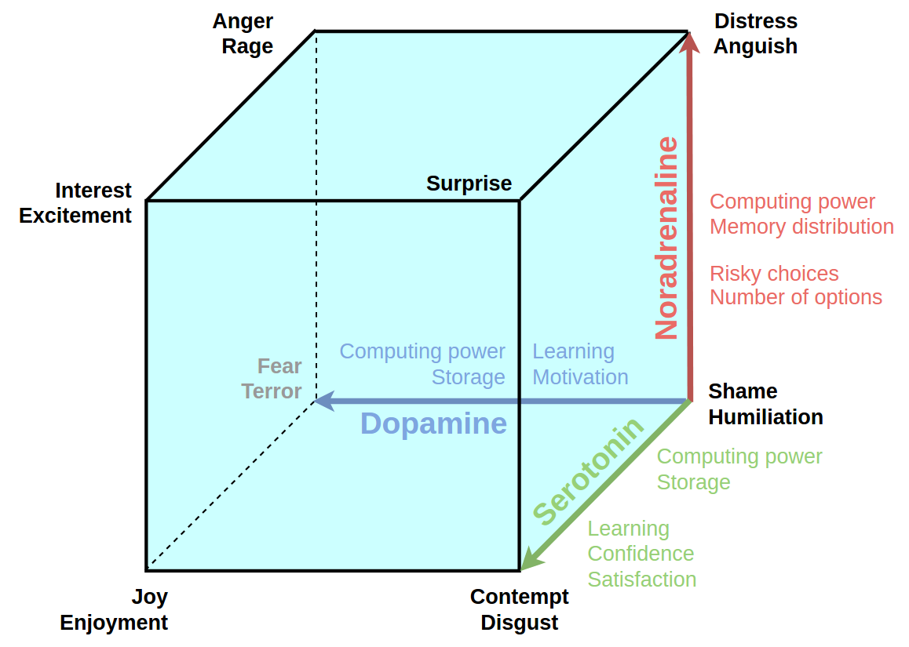

# Quick links
1. [Installation](#installation)
# Neuromodulating Cognitive Architecture project

## Problem

Starting from works of Darwin emotions attract a lot of attention of researchers especially in the field of psychology. The main reason for this interest seems to be obvious as emotions play crucial role in mammalian life. Starting from seminal works of Rosalind Picard "Affective computing" the ideas or the emotional recognition and the reimplementation of emotions in a computational machine are gaining their popularity. For some years the artificial intelligence systems were designed not taking in account any emotional influence over decision making and behavioral strategies of mammals instead the reasoning and machine learning approaches were introduced. Modern view on the role of emotions in a mammalian social life puts us in position to reimplement bio-plausible emotional drives in a computational system. 

"How can we make machine feel emotion" this is the key question of the project.
We have selected the ["cube of emotions"](https://en.wikipedia.org/wiki/L%C3%B6vheim_cube_of_emotion) as the neuro-psychological basement of our reimplementation project. It was published by Hugo Lövheim in 2012 and maps three monoamine neuromodulators: noradrenaline, serotonin, noradrenaline and basic emotional states (affects): fear, joy, disgust, humiliation, anger, interest, surprise, distress. We have extended the 3D model with the influence over computational processes based on role of neuromodulators. 

More specifically, the computational system parameters taken into account are as follows:

1. **Computing utilization** is a metric to quantify how busy the processing resources of the system are. It is expressed by the average value of all the single processing resources' utilization.
1. **Computing distribution** quantifies the load balancing among processing resources. It is expressed as the variance of single resources' utilization.
1. **Memory distribution** is associated with the amount of memory allocated to the processing resources. It is quantified by the variance of the amount of memory per single resource.
1. **Storage volume** is an index related to the the amount of data and information used by the system. 
1. **Storage bandwidth** quantifies the number of connections between resources, i.e. processing and data nodes.

The researcher guide of and experimental approach could be found [here](neucogar.md).

We have implemented three subsystems of three monoamines neuromodulators that are represented below in neurosimulator [NEST](http://www.nest-simulator.org/community/) and run the seres of experiments implementing all 8 affects. Two examples of experiments are represented below.

## Dopamine pathways

## Noradrenaline pathways

## Serotonin pathways

## Fear like state

At the 400 ms we increase the level of the DA placing the simulated brain in the "fear-like" state later at 410 ms we register the increased activity of the motor cortex (green bars) and the thalamus (blue bars) at the same time we could register the increased computational capacity orange graph.

## Disgust like state 

At the 200 ms we increase the level of the 5HT placing the simulated brain in the "disgust-like" state later we register the decreased activity of the motor cortex (blue bars) at the same time we could register the decreased computational capacity orange graph. At the 400 ms we reproduce the experiment with the DA described above.

## Breakthrough

**AI and robotics**: New architectures of robotic systems, will be significantly different from the existing computers/robots. The proposed architecture of new generation of robots will be capable of self learning and will not be using traditional software approaches making software development obsolete.

**Affective computing** - first time the bio-plausible implementation of psycho-emotional states mapped to computational processes will be demonstrated. 

**Cognitive architectures and robotics** - first time the bio-plausible emotional drives will be implemented to form behavioral strategies of an artificial system. We have already demonstrated: "fear-like" and "disgust-like" states.

## Installation
**Description**
The project use 3 repositories.
1. [neucogar-lib]  (!https://github.com/research-team/neucogar-lib) -- lib for the NEST which used by Neucogar;
1. [neucogar-nest] (!https://github.com/research-team/neucogar-nest) -- for of the [NEST] framework;
1. [neucogar] -- main repo.

